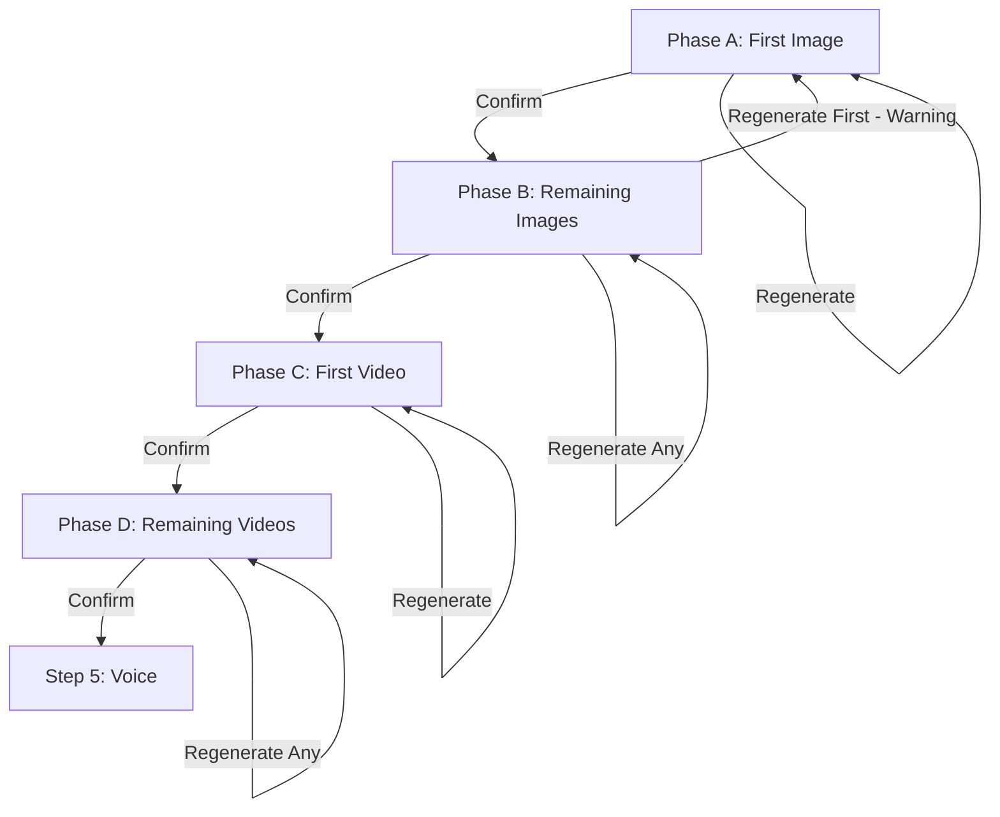

# Step 4 Visual Generation - Implementation Specification

## Summary

Redesign Step 4 (Generate Visuals) to use a phased approach with four distinct sub-phases, each with its own approval gate. This ensures the user establishes visual consistency through the first image before batch-generating remaining images, and establishes video style through the first video before generating the rest.

---

## Workflow Phases



### Phase A: First Scene Image
- User generates Scene 1's image using its `image_prompt`
- User can directly edit the prompt and regenerate until satisfied
- "Confirm & Continue" locks this as the style reference

### Phase B: Remaining Scene Images  
- All remaining images generated **sequentially** using the confirmed first image as style reference
- User can regenerate any individual image by editing its prompt
- User can regenerate the first image (warning: clears all other generated images)
- "Confirm & Continue" locks all images and proceeds to video phase

### Phase C: First Video
- User defines a `video_style` field (motion, pacing, camera style)
- First video generated from Scene 1's image using: `video_style` + `video_prompt`
- User can edit `video_style` and regenerate until satisfied
- "Confirm & Continue" locks the video style

### Phase D: Remaining Videos
- All remaining videos generated **sequentially**
- Each video uses the confirmed `video_style` combined with its scene's `video_prompt`
- User can regenerate any individual video by editing its `video_prompt`
- "Confirm & Continue" completes Step 4

---

## State Derivation Logic

Instead of explicit sub-phase tracking, derive the current phase from existing data:

```typescript
function deriveCurrentPhase(scenes: Scene[], assets: Asset[], shotList: ShotList) {
  const scene1 = scenes.find(s => s.order_index === 1)
  const scene1Image = assets.find(a => a.scene_id === scene1.id && a.type === 'image')
  const scene1Video = assets.find(a => a.scene_id === scene1.id && a.type === 'video')
  
  const allImagesComplete = scenes.every(s => 
    assets.some(a => a.scene_id === s.id && a.type === 'image' && a.status === 'complete')
  )
  const allVideosComplete = scenes.every(s => 
    assets.some(a => a.scene_id === s.id && a.type === 'video' && a.status === 'complete')
  )
  
  // Phase A: No confirmed first image
  if (!scene1Image || !shotList.first_image_confirmed_at) return 'phase_a'
  
  // Phase B: First image confirmed, not all images complete OR not confirmed
  if (!allImagesComplete || !shotList.all_images_confirmed_at) return 'phase_b'
  
  // Phase C: All images confirmed, no confirmed first video
  if (!scene1Video || !shotList.first_video_confirmed_at) return 'phase_c'
  
  // Phase D: First video confirmed, not all videos complete
  if (!allVideosComplete) return 'phase_d'
  
  return 'complete'
}
```

---

## Database Changes

### shot_lists table - Add columns:

| Column | Type | Description |
|--------|------|-------------|
| `video_style` | `text` | User-defined video style applied to all videos |
| `first_image_confirmed_at` | `timestamp` | When Phase A was confirmed |
| `all_images_confirmed_at` | `timestamp` | When Phase B was confirmed |
| `first_video_confirmed_at` | `timestamp` | When Phase C was confirmed |

---

## API Endpoints

### Existing endpoint modification: `POST /api/generate/visuals`

Add new parameters:

```typescript
const requestSchema = z.object({
  projectId: z.string().uuid(),
  sceneId: z.string().uuid().optional(),
  phase: z.enum(['first_image', 'remaining_images', 'first_video', 'remaining_videos']),
  videoStyle: z.string().optional(), // For video generation
  imagePrompt: z.string().optional(), // Optional prompt override
  videoPrompt: z.string().optional(), // Optional prompt override
})
```

### New endpoint: `POST /api/generate/visuals/confirm`

```typescript
const requestSchema = z.object({
  projectId: z.string().uuid(),
  phase: z.enum(['first_image', 'all_images', 'first_video', 'all_videos']),
  videoStyle: z.string().optional(), // Required when confirming first_video
})
```

This endpoint:
- Updates the appropriate `*_confirmed_at` timestamp
- Stores `video_style` when confirming Phase C
- Validates all assets in the phase are complete before allowing confirmation

### Reset endpoint: `DELETE /api/generate/visuals/confirm`

Query parameters:
- `projectId`: Project to reset
- `resetTo`: `'first_image'` or `'first_video'`

This endpoint handles resetting to earlier phases when the user wants to regenerate the first image or first video.

---

## UI Components

### Main page structure (visuals/page.tsx)

The page renders different UI based on `deriveCurrentPhase()`:

**Phase A UI:**
- Single large card for Scene 1
- Image preview (or placeholder)
- Editable `image_prompt` textarea
- "Generate Image" / "Regenerate" button
- "Confirm & Continue" button (enabled when image exists)

**Phase B UI:**
- Scene 1 card (with warning if user clicks regenerate)
- Grid of all other scenes showing generation progress
- Individual regenerate buttons per scene
- "Confirm All Images" button (enabled when all complete)

**Phase C UI:**
- Scene 1 image displayed (locked)
- `video_style` textarea (editable)
- Scene 1 video preview
- "Generate Video" / "Regenerate" button
- "Confirm & Continue" button

**Phase D UI:**
- Video style shown (locked, display only)
- Grid of all scenes showing video generation progress  
- Individual regenerate buttons per video
- "Confirm All Videos" button

---

## Generation Logic Changes

### Image Generation

**Phase A (first image):**
```typescript
// No reference image - this becomes the reference
const result = await generateImage(scene.image_prompt)
```

**Phase B (remaining images):**
```typescript
// Use first image as style reference
const firstImageBase64 = await fetchFirstImageBase64(projectId)
const result = await generateImage(scene.image_prompt, firstImageBase64)
```

### Video Generation

**Phase C (first video):**
```typescript
const fullPrompt = `${videoStyle}. ${scene.video_prompt}`
const result = await generateVideo(fullPrompt, sceneImageBase64, scene.duration_seconds)
```

**Phase D (remaining videos):**
```typescript
// Use confirmed video_style from shot_list
const fullPrompt = `${shotList.video_style}. ${scene.video_prompt}`
const result = await generateVideo(fullPrompt, sceneImageBase64, scene.duration_seconds)
```

---

## Regeneration Behavior

### Regenerating First Image (from Phase B)
1. Show warning modal: "Regenerating the first image will clear all other generated images since they use it as a style reference."
2. If confirmed:
   - Delete all image assets except scene 1
   - Clear `all_images_confirmed_at`
   - Clear `first_image_confirmed_at`
   - Return to Phase A

### Regenerating Any Other Image (Phase B)
- Simply regenerate that scene's image using first image as reference
- No other images affected

### Regenerating First Video (from Phase D)
- Not allowed after Phase D starts
- User must regenerate individual videos instead

### Regenerating Any Video (Phase D)
- Regenerate using the locked `video_style` + scene's `video_prompt`
- User can edit the scene's `video_prompt` before regenerating

---

## Files Modified

1. **visuals/page.tsx** - Complete rewrite with phase-based UI
2. **api/generate/visuals/route.ts** - Add phase support
3. **api/generate/visuals/confirm/route.ts** - New phase confirmation endpoint
4. **types/database.ts** - Update types for new shot_list columns
5. **Supabase migration** - Add new columns to shot_lists table

---

## Cost Estimation per Phase

Display estimated costs before each generation phase:

- **Phase A:** Cost for 1 image
- **Phase B:** Cost for (N-1) images  
- **Phase C:** Cost for 1 video
- **Phase D:** Cost for (N-1) videos

